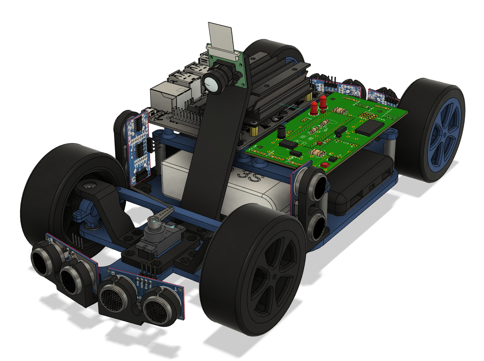

# Autonomous Car Platform

## Overview
Welcome to the repository of an educational platform designed as an autonomous toy car. The whole project consists of mechanical design, electronics board and lots of code. The main goal was to design a platform for students who want to experience building a prototype and learn technologies like Machine Learning or Computer Vision with it.

## Docs
- [Image processing](docs/image_processing.md)
- [Sign detection](docs/sign_detection.md)
- [Dashboard](docs/dashboard.md)
## Features
- Remote dashboard 
- Object detection (road signs)
- Lane following based on camera view
## Main components
1. Nvidia Jetson Nano (2 or 4 GB version)
2. STM32 BlackPill
3. Wide-angle CSI camera
4. Wifi dongle (unless WiFi natively supported by your board)

## Prerequisites/setup
### Ubuntu Image for Nvidia Jetson Nano
Make sure that you have done the initial setup for Nvidia Jetson Nano. Download the newest OS image and write it to microSD card. [Click here to see the official instructions from Nvidia](https://developer.nvidia.com/embedded/learn/get-started-jetson-nano-devkit#prepare).

### First Jetson Nano run
Initially I recommend booting your Nano with a display and keyboard connected to it (desktop setup). It will save you some time setting up the network and testing the camera. Later on you can switch to headless mode.

### WiFi connection
The platform is mobile, so WiFi connection is used to allow for remote control and telemetry.
Connect to your local WiFi network and check your Nano's IP address using `ifconfig`.

### Test your camera
Make sure you have the CSI camera connected. Try to capture a picture:
```
cd
nvgstcapture-1.0
```
Then press `j` on your keyboard to save the image. Press `q` to quit.

If you run in desktop mode, open the captured picture with file explorer.

If you run in headless mode, copy the captured image to your PC and view it there. [See how](#copy-files-to-your-local-machine)

#### Pink tint
If your photo has an ugly pink tint and looks like this:


Follow the instructions that lead to [UPDATING THE ISP PROFILE](https://jonathantse.medium.com/fix-pink-tint-on-jetson-nano-wide-angle-camera-a8ce5fbd797f).

### SSH - headless mode
In order to take control over your Jetson Nano's terminal and work in headless mode (recommended due to platform mobility) the SSH protocol is used. On your PC run cmd and execute `ssh <nano's ip address>`. You will be asked for the password to Jetson Nano user. You should now be able to run bash commands on your Jetson Nano remotely.

If you wish to skip password prompt everytime you connect via ssh, follow these steps:
- generate key pair (public-private) on your local machine `ssh keygen`
- copy the public key to `/home/{user}/.ssh` on the remote host

### Copy files to your local machine
```
scp <remote host ip>:<path/sourceFilename.xxx> <path to destination folder>
```

### Jetson Inference

This project uses a portion of the great Nvidia Jetson library - [jetson-inference](https://github.com/dusty-nv/jetson-inference) made by [dusty-nv](https://github.com/dusty-nv).

The library lets you deploy DNNs on Nvidia embedded platforms. It utilises TensorRT. 

The car is supposed to detect traffic signs, so I implemented object detection. The library itself is capable to do much more than that, though.

There is also a side-package called jetson-utils, which is very useful for simple and efficient image processing with GPU. 

I used scripts implemented in jetson-inference to: 
- prepare test & training datasets, 
- transfer-learn an existing DNN
- run the detection.

To run this project you need to install [jetson-inference](https://github.com/dusty-nv/jetson-inference) on your Jetson Nano. Please follow the [Building from source markdown](https://github.com/dusty-nv/jetson-inference/blob/master/docs/building-repo-2.md). Make sure to check the `Object detection -> SSD Mobilenet v2` (Downloading Models section) as it will be used as a base model for transfer-learning.

I highly recommend taking a look at the tutorials that come with the library as they show potential of the library.  

### External libraries
Install a few packages this project depend on.

``` bash
sudo apt-get upgrade
pip3 install --upgrade setuptools
sudo apt-get install redis-server
pip3 install pyserial redis python-engineio flask-socketio
```
## Installation
The installation comes down to cloning this repository, but make sure you have followed all the steps from Prerequisite section.
``` bash
git clone https://github.com/Bulduper/AutonomousCar.git
cd ./AutonomousCar
```
## Wiring
Nvidia Jetson Nano communicates with STM32 via UART protocol. Both processing units have separate power sources, so there are only 3 wires that need to be connected between them.
| Jetson Nano | STM32F411 Black Pill |
|-------------|----------------------|
| PIN 10 (RX) | A8 (TX)              |
| PIN 8 (TX)  | A9 (RX)              |
| PIN 6 (GND) | GND                  |


- Connect your camera using a ribbon cable to a CSI connector on the Jetson board.
- Plug a WiFi dongle to a USB port (if no embedded wifi).
- Plug a 5V/3A (or more amperes) power supply or a 5V powerbank via USB type-C connector on the board.
- (Optional) Attach a fan to the heatsink and plug it to J7 Fan header

## Run
Change the access permissions to UART port*.
```bash
sudo chmod 666 /dev/ttyTHS1
```
Run redis server on port 7777
```bash
redis-server --port 7777
```
In a new terminal window run the uart module, which is responsible for exchanging data with uC unit.
```bash
python3 uart_module.py
```
In another terminal window start the http server which is hosting the UI web app.
```bash
python3 web-app/web-app_server.py
```
Finally run the main script
```bash
python3 main.py
```

\* To avoid repeating this step after every reboot follow these commands:
```bash
systemctl stop nvgetty
systemctl disable nvgetty
udevadm trigger
wget https://raw.githubusercontent.com/karaage0703/jetson-nano-tools/master/udev_rules/55-tegraserial.rules
sudo mv 55-tegraserial.rules /etc/udev/rules.d/
```


## Development
Feel free to fork this repo and experiment with the code.

### Headless - VS Code SSH
The way I am developing&debugging this usecase is using Visual Studio Code with [SSH Remote extension](https://code.visualstudio.com/docs/remote/ssh). It is extremally useful and lets you forget that you actually write code, debug, explore filesystem and use terminal on other machine. All these goodies in the code editor that I am used to anyway.

However... VS Code Server on your Jetson will use a lot of RAM (approx. 500MB, maybe more depending on running functionalities). You may experience crashes and lagging while VS Code server working, especially on running DNNs or other RAM heavy operations. In such cases you should close the VS Code window on your PC (or pause the server on Jetson - I couldn't find how to do it without permanently killing the process).

### Less headless - NoMachine
If you would like to keep your Jetson remote and mobile, but still want a desktop (GUI) access, I recommend using [NoMachine](https://www.nomachine.com/es). All you need is install NoMachine client on your PC and NoMachine server on Jetson. [Here](https://knowledgebase.nomachine.com/AR02R01074) you can find a tutorial on how to get NoMachine up and running.
## Optimise
### Disable GUI
### Disable redis-server autostart
## Common problems